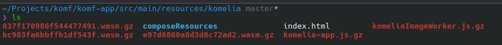
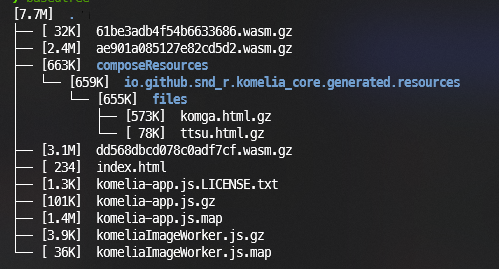

# Build instructions from @Snd

## Before you start...
Install the following on your build machine:
- Java Development Kit (or Android Studio, which includes a JDK)
- npm (or nodejs, which includes npm)

## Steps

`wasm` build is a bit wonky and I don't really test that it works on `main` branch

To build it for `komf` you'll need to manually run a few commands and then move the files to `komf` app `resource` directory.

Make sure that you cloned `komf` with submodules:
`git clone --recursive https://github.com/Snd-R/komf`

Or if you already have a repository, run:
`git submodule update --init --recursive`

Then go to `Komelia` directory and run these commands:
- `./gradlew :komelia-image-decoder:wasm-image-worker:wasmJsBrowserDistribution`
- `./gradlew buildWebui`  (this builds epub readers)
- `./gradlew :komelia-app:wasmJsBrowserDistribution`

Main app optimized build can take a really long time.
On my RyZen 9 3950X 16 core cpu it takes around 17 minutes.

Then copy all files from
`./Komelia/komelia-image-decoder/wasm-image-worker/build/dist/wasmJs/productionExecutable/`
 and 
`./Komelia/komelia-app/build/dist/wasmJs/productionExecutable/`
to `komf` resource directory `komf-app/src/main/resources/komelia`

Last step is to gzip all files except the `index.html`. On linux you can run `gzip <filename>` for each file and it will create file.gz in place of old file.

For this step, navigate to `komf-app/src/main/resources/komelia` and run the following:
`find . \( -name "*.wasm" -o -name "*.js" -o -name "komga.*" -o -name "ttsu.html" \) -exec gzip {} \;`

The final file structure should look like something on this screenshot

